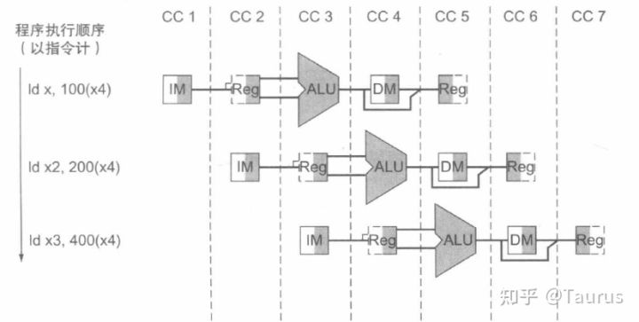
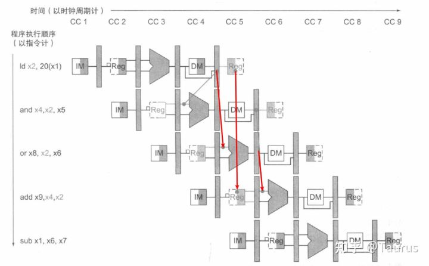
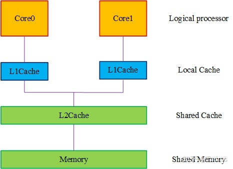
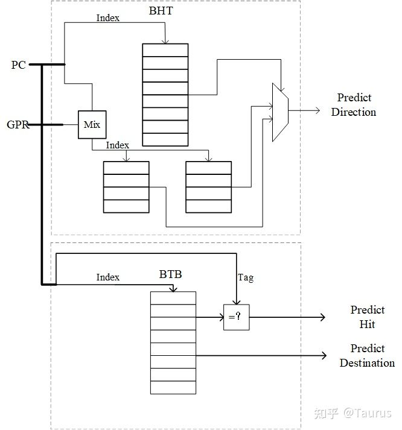
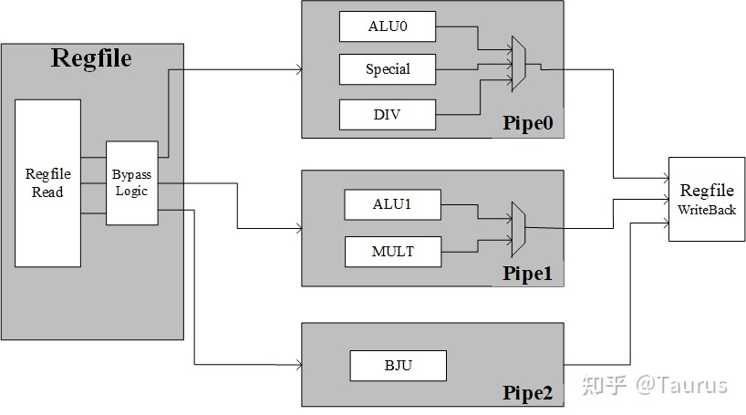
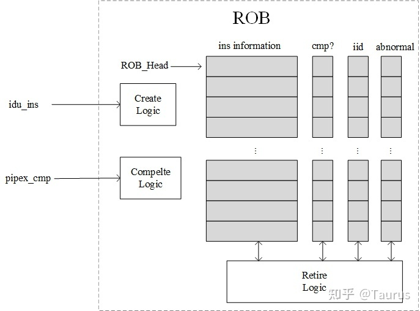

这里是关于学习玄铁c910的一些笔记
====
https://zhuanlan.zhihu.com/p/456409077

开始是一些基础的东西，

## 经典的五级流水线

五级流水结构将指令的执行分为五个阶段，分别是取指、译码、执行、访存和写回

在经典五级流水结构中，流水线的正确流动执行需要处理冒险的问题。
对部分的数据冒险可以通过提供数据旁路来解决，被称为数据前馈。

在指令执行到写回阶段前就可以通过旁路将结果传导到需要的地方。但需要注意的，有些数据冒险是没有办法通过前馈来解决的。

**控制冒险**，指的是后续的指令由于前面的分支指令而产生的冒险。而**结构冒险**指的是有限的硬件资源带来的冒险。
而对于那些无法通过现有技术解决的冒险则需要通过冒险检测逻辑，然后停顿来解决。

# 要学习一点五级流水线

## 超标量处理器

虽然我们加入了流水线技术挖掘了一定的指令间的并行处理，但是我们还是停留在每个时钟周期只发射一条指令的阶段，我们把这种类型的处理器叫做**标量处理器**。

如果我们能够支持每个周期发射多条指令给多个执行单元进行执行，那么我们处理器的性能一定能大幅度提升，而这种每个周期能发射多条指令的处理器我们叫**超标量处理器**。

而超标量处理器也分为顺序发射的处理器和乱序发射的处理器，为了完全发挥超标量处理器的性能，现代高性能处理器基本是乱序发射的

而**玄铁C910处理器**就是一款**超标量乱序发射、乱序执行、顺序写回**的处理器，拥有 ==3译码8执行3退休==   why and what is it    的超标量架构，对软件开发人员透明，同时在指令发射的结构中还支持非阻塞发射与投机猜测的执行，除此之外还支持基于物理寄存器的重命名技术来解决部分冒险。

在玄铁这款超标量处理器中还包含了如缓存预取，缓存路预测，分支预测，乱序访存，访存写合并等技术来提高处理器性能与降低处理器功耗。

2.2.1 缓存技术

​在经典五级流水结构中没有强调缓存技术，但是由于处理器与大容量存储器间的速度鸿沟愈发明显，而高速的存储器又无法做到大容量，那么访问存储器的行为就很容易称为系统的性能瓶颈。因而现代的高性能处理器都会采用**多层次的缓存技术**来减小访存带来的延时。下面我们就会介绍缓存相关的几种技术，并介绍在玄铁C910处理器中的应用。对缓存的详细描述可以参考《计算机体系结构量化方法》附录B部分

多层次缓存：

​由于存储器的速度与容量间具有矛盾，我们不能奢求又大又快的存储器，所以我们需要设计一套存储方案来调和这种矛盾。架构师们从程序运行的局部性出发，发明了一种多层次的缓存层次**在有限的快速存储空间内来减少存储器的访问时间**。如图2-1所示为玄铁C910处理器的缓存组织结构，玄铁C910处理器的指令和数据L1 Cache均为64KB的容量，其Cache Line大小为64B，采用2路组相联的组织形式，采用写回策略，而写分配与否可以配置。**而L2 Cache作为多核的共享Cache**，其容量为1MB，Cache Line大小为64B，采用16路组相联的组织形式，采用的写策略与L1 Cache相同。

缓存预取：

​硬件缓存预取技术的指导思想也是程序访问的局部性，**当Cache发生miss时，会将另一块Cache Line的数据提前预取到预取Buffer中去，这样就有可能避免下一次Cache miss带来的penalty**。一般预取的地址都是与此次miss相邻的地址。在玄铁C910处理器中指令L1 Cache支持硬件上的缓存预取技术，当缓存发生缺失时，会开启下一条Cache Line的读取以应对可能存在的下一次Cache Line的缺失，降低带来的性能损失   **这里是为什么呢？** 。而在数据L1 Cache中还支持了最多8个通道的数据预取技术，实现了连续预取、间隔预取、正向预取和反向预取等多个模式的数据预取，提高了缓存的访问性能。

​**还有一种预取技术是编译器指导的预取，编译器分析程序的行为，通过某些特殊的缓存指令指导缓存进行特定的预取。**通常这种预取具有更高的特殊性，对某些特殊程序会有更高的效率。但是在玄铁C910处理器中并没有对应的指令对其支持。

缓存路预测：

​缓存的映射方式有直接映射、组相联和全相联，除了直接映射外，其他两种方式在访问缓存时都会提前读取几个Cache Line的数据，然后再根据Tag的比较结果来选择一路给到CPU。**玄铁C910处理器的L1 Cache采用的是2路组相联的形式**，为了减少并行访问的两路缓存的功耗，其支持对这两路缓存的路选择信息进行预测，如果开启则会对顺序访问与跳转访问进行特定路的预测，而关闭另一路的访问以减少系统的功耗。

缓存增强指令：

​玄铁C910处理器还对RISC-V标准指令集的基础上增添了不少针对Cache的增强指令，如对Cache Line的无效化、清除脏表项等功能的指令，通过使用这些指令对系统的性能进行优化。

## 主要部分： 分支预测

据统计，平均每6条指令就会遇到一条分支指令，所以控制冒险对系统性能的影响很大。

对分支预测的详细描述可以参考《计算机体系结构量化方法》附录C部分

**普通分支指令**采用的是64Kb的**两级多路并行的分支预测器和1024表项的分支目标缓存器**，对**间接跳转指令**还配有256表项的间接跳转分支预测器与12层的硬件返回地址堆栈，而且对于特殊的短循环的情况还配有短循环缓存。

**这张图片估计很重要，要尝试搞懂他**

## 别的一些东西

2.2.3 寄存器重命名技术

​对寄存器重命名技术的详细描述可以参考《计算机体系结构量化方法》第三章部分

​在五级流水中我们提到阻碍流水线顺畅流动的一大因素是冒险，而其中的数据冒险对性能也有较大影响。**但是并不是所有的数据冒险都会带来造成流水线停顿的问题，如WAW与WAR冒险其实是没有实际的数据流通路的，通过寄存器重命名技术的使用我们就可以将这两种冒险解决。**因此，我们只需要关注真正存在数据流动的RAW冒险即可。

​寄存器重命名分为显示重命名和隐式重命名。玄铁C910处理器采用显示重命名方式，基于架构中配置的96个物理寄存器的方式来对程序中的逻辑寄存器进行重命名以解决指令间的数据相关性，在译码单元内会管理物理寄存器与逻辑寄存器间的对应表，主要负责为指令分配物理寄存器、释放过时的物理寄存器以及在异常发生时对应表的还原。

2.2.4 指令的乱序发射

​乱序处理器中关键的一步就是要支持指令的乱序发射，而在超标量的背景下还需要考虑一个指令包间的依赖关系。由于乱序发射逻辑将一定程度上决定能够发射指令的数量，所以乱序发射在超标量处理器中是至关重要的。

​玄铁C910处理器会管理在译码阶段会**管理一个发射队列，可以支持同时对三条指令进行译码并检测数据相关性，由于在重命名技术的加持下，我们尽可能地减少了数据冒险。**而在此处，玄铁C910处理器还加入了投机猜测执行（speculation）来缓解控制冒险带来的性能损失，然后配合发射队列的乱序调度分发能够达到较高的指令发射性能。

2.2.5 执行单元并行

​超标量处理器的多发射的特性就决定了其必然含有**多个执行单元**，而这些执行单元通常是不同的。由于读写端口的限制，现代的处理器一般会对执行单元进行分组分块，然后为这些组进行读写端口与指令的分配。

​玄铁C910处理器的执行单元就包括整型执行单元（IU）和浮点单元（FPU）。整型单元内含有完成逻辑和简单算术运算的ALU、完成整数乘法的MULT，完成除法的DIV单元和完成分支处理的BJU单元，浮点单元内含有完成算术运算的FALU，完成融合乘累加的FMAU和浮点除法开方单元的FDSU。而且执行单元内部也对这些执行模块进行了分组，以整形单元为例，其分组情况如图2- 3所示。

玄铁C910处理器还提供了一些计算的增强指令以加强程序执行的性能，如浮点乘加融合、快速找1、字节翻转等指令。具体内容可以参考玄铁的用户手册

2.2.6 乱序处理器的访存复杂性

​当访存动作遇到乱序处理器，问题就会变得复杂起来。**首先load，store指令会和普通指令一样需要检测正常的数据冒险等冲突。**但是由于load和store真正作用的内存地址是通过计算得到的所以检测访存指令间的冲突就变得复杂了起来，对访存指令进行单独管理的部件是LSU，在现代高性能处理器中是必不可少的一部分。

​玄铁C910处理器的LSU对访存指令的执行可以支持双发射、全乱序执行的load、store指令，同时支持读写各8路并发的总线访问，配合上支持写合并的写缓冲就可以达到高效率的访存指令的执行效率。由于访存指令的复杂度较高，详细分析会在后续章节中进行阐述。

2.2.7 虚拟存储器

​对虚拟存储器的详细描述可以参考《计算机体系结构量化方法》第二章部分

​计算机中不同的进程拥有自己的存储空间，**但由于存储器的大小限制没有办法让所有的进程都使用完整的地址空间，因此需要将物理存储器分成块，分配给不同的进程，因此在程序上看到的是虚拟地址与实际存在于物理存储器中的地址有所不同，他们之间的映射关系由操作系统进行管理，在内存中有一块空间用于存储页表，存储虚拟地址和物理地址的映射关系。**因此，处理器在每次取指或者访存时都需要对虚拟地址进行翻译，而现代处理器也会为**页表设置缓存，被称为TLB。**

​玄铁C910处理器采用两级TLB结构，其中第一级为容量小的全相联缓存，第二级为4路组相联缓存，并且支持混合存储三种大小的页面，第一级TLB在请求后的当拍即可得到物理地址，大大提高了地址翻译的性能。内存管理部分，包括地址转化、页面保护、页面属性管理、内存保护等是现代处理器必不可少的一环，具体的细节在后续的源码学习中会进行详细的介绍。

2.2.8 重排序缓存技术

​对**重排序缓存技术**的详细描述可以参考《计算机体系结构量化方法》第三章部分

​我们上文中提到为了提高超标量处理器的性能，我们将指令的发射和执行都做了乱序的处理。但是为了保证程序的语义不变，**我们需要对执行完的指令进行顺序的写回（退休）**，而完成这一部分操作就需要用到重排序缓存技术。

​玄铁C910处理器每个时钟周期可以并行退休三条指令。退休单元内包含一个重排序缓冲器与一个物理寄存器状态堆，其中，重排序缓冲器负责指令的乱序回收与按需退休，也能够利用重排序缓冲支持精确异常，物理寄存器状态堆负责结果的乱序回收以及释放。玄铁还支持了指令的并行回收以及指令的快速退休机制来提高指令退休的效率。图2-4展示了重排序缓存的框图。

## 多核并行

处理器单核的优化空间可能有限，那么我们也许可以将目光转到多核并行的维度上。玄铁C910处理器支持实现同构的双核架构，支持每个核心的独立下电以及cluster下电以管理功耗。