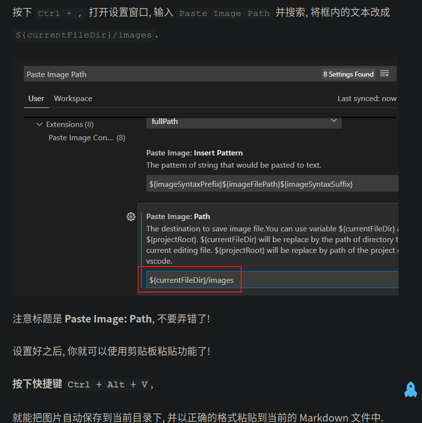
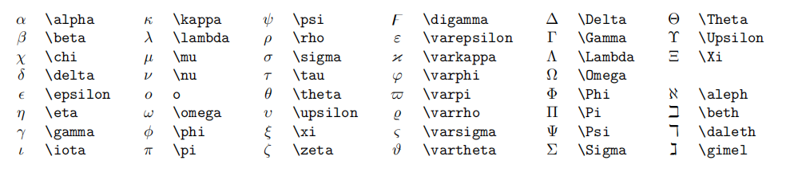

# hello,world

# 一级标题

## 二级标题

### 三级标题

每写完一个段落都要隔一个空行。
然后按照先后顺序按下快捷键 Ctrl + K, V, 然后在右边就会出现预览窗口.

[来源](https://orangex4.cool/post/notes-in-markdown/)

个一个空行


公式块

    快捷键：ctrl+shift+M


---


分割线

**重点加粗**

*斜体*

～～删除线～～

~~删除线~~

---
这样呢

列表：

* 无序列表
    * 嵌套
    * 嵌套
* 无序列表
* 无序列表


1. 有序列表
   1. 嵌套
   2. 嵌套
2. 列表

---
引用文本：

> 引用别人说的话
> 就这样写


---

行内代码的语法

``` python
print("hello,world"!)
```

---

[超链接名称](链接地址)


！[图片提示语](图片地址)

---

表格：

| 表头 | 表头 |
| ---- | ---- |
| 内容 | 内容 |


---
注释：

<!-- 你看不见我 -->


一级标题
==========

二级标题
----

**==高亮==**
==高亮==


选中文本之后, 按下 Ctrl + B 可以给选中文本加粗.

同理 Ctrl + I 可以让选中文本变为斜体.


任务列表：

- [x] 已经完成的
- [x] wancheng
- [x] 没有完成


    一个人两个
    yyyy

    ~~yiyiyi~~

要进行缩进 (书写嵌套列表), 你可以使用 VSCode 的快捷键 Ctrl + [ 和 Ctrl + ] 向右.

``` javascript {.line-numbers}
function add(x,y) {
    return x+y
}
```


超链接名称](链接地址)


例如, 可以使用网址和图床:

[OrangeX4's Blog](https://orangex4.cool/)


也可以在本地用相对地址:

[Other](other.md)

<!---->


按下快捷键 Ctrl + Alt + V,

就能把图片自动保存到当前目录下, 并以正确的格式粘贴到当前的 Markdown 文件中




拓展语法:

| 表头 | 表头 |
| ---- | ---- |
| 内容 | 内容 |
| >    | 内容 |

| 表头 | 表头 |
| ---- | ---- |
| 内容 | 内容 |
| ^   | 内容 |


快捷键:

自动表格对齐: Shift + Alt + F

1234 145 222
12 hihi ooo
13 wo 和

<u>下划线</u>


行内公式: 

单位圆 $x^2+y^2=1$

公式块:

$$
\begin{cases}
x=\rho\cos\theta \\
y=\rho\sin\theta \\
\end{cases}
$$


还有, 不要在公式内使用中文, 除非是 \text{中文} (但是也不推荐)


上标 $x^2 + y^{12} = 1$

上标 $x_1 + y_{12} = 1$

自动补全：

^{-1}
\alpha_1,\alpha_2,\cdots,\alpha_n

自动补全:

    \\-1 ⇒ ^{-1}
    \\comma ⇒ \alpha_1,\alpha_2,\cdots,\alpha_n


较小的行内行分数 $\frac{1}{2}$

展示型的分式 $\displaystyle\frac{x+1}{x-1}$


自动补全:

选中文本时, x+1 + \\frac ⇒ \frac{x+1}{}

在自动补全之后, 按下 Tab 键可以切换到下一个位置!

开平方 $\sqrt{2}$

开 $n$ 次方 $\sqrt[n]{2}$

自动补全:

选中文本时, x+1 + \\sqrt ⇒ \sqrt{x+1}

输入空格:

紧贴 $a\!b$

没有空格 $ab$

小空格 $a\,b$

中等空格 $a\;b$

大空格 $a\ b$

quad 空格 $a\quad b$

两个 quad 空格 $a\qquad b$


累加 $\sum_{k=1}^n\frac{1}{k}  \quad  \displaystyle\sum_{k=1}^n\frac{1}{k}$

累乘 $\prod_{k=1}^n\frac{1}{k}  \quad  \displaystyle\prod_{k=1}^n\frac{1}{k}$

积分 $\displaystyle \int_0^1x{\rm d}x  \quad  \iint_{D_{xy}}  \quad  \iiint_{\Omega_{xyz}}$


自动补全:

    \\sum ⇒ \sum_{i=1}
    \\prod ⇒ \prod_{i=1}
    \\lim ⇒ \lim_{x\to \infty}


圆括号 $\displaystyle \left(\sum_{k=1}^{n}\frac{1}{k} \right)^2$

方括号 $\displaystyle \left[\sum_{k=1}^{n}\frac{1}{k} \right]^2$

花括号 $\displaystyle \left\{\sum_{k=1}^{n}\frac{1}{k} \right\}^2$

尖括号 $\displaystyle \left\langle\sum_{k=1}^{n}\frac{1}{k} \right\rangle^2$


自动补全:

    \\angel ⇒ \langle \rangle
    \\set ⇒ \{ \}
    \\bracket ⇒ \left( \right)
    \\square_bracket ⇒ \left[ \right]
    \\curly_bracket ⇒ \left\{ \right}


居中:

$$
\begin{aligned}
y &=(x+5)^2-(x+1)^2 \\
&=(x^2+10x+25)-(x^2+2x+1) \\
&=8x+24 \\
\end{aligned}
$$

左对齐:

$
\begin{aligned}
y &=(x+5)^2-(x+1)^2 \\
&=(x^2+10x+25)-(x^2+2x+1) \\
&=8x+24 \\
\end{aligned}
$


$$
\begin{cases}
k_{11}x_1+k_{12}x_2+\cdots+k_{1n}x_n=b_1 \\
k_{21}x_1+k_{22}x_2+\cdots+k_{2n}x_n=b_2 \\
\cdots \\
k_{n1}x_1+k_{n2}x_2+\cdots+k_{nn}x_n=b_n \\
\end{cases}
$$


矩阵:

$$
\begin{pmatrix}
1 & 1 & \cdots & 1 \\
1 & 1 & \cdots & 1 \\
\vdots & \vdots & \ddots & \vdots \\
1 & 1 & \cdots & 1 \\
\end{pmatrix}

\quad

\begin{bmatrix}
1 & 1 & \cdots & 1 \\
1 & 1 & \cdots & 1 \\
\vdots & \vdots & \ddots & \vdots \\
1 & 1 & \cdots & 1 \\
\end{bmatrix}
$$ 

行列式: 

$$
\begin{vmatrix}
1 & 1 & \cdots & 1 \\
1 & 1 & \cdots & 1 \\
\vdots & \vdots & \ddots & \vdots \\
1 & 1 & \cdots & 1 \\
\end{vmatrix}
$$




更多特殊符号可以 上网查询

可以搜索 “Latex 符号表”


11. 公式编号与引用

$$
x+2 \tag{1.2}
$$

$$
\begin{equation}
x^n+y^n=z^n
\end{equation}
$$

由公式 $(1.2)$ 可得到结论


12. 零碎的重要语法

    点乘 $\cdot$, 叉乘 $\times$, 异或 $\otimes$, 直和 $\oplus$, 加减 $\pm$, 复合 $\circ$.
    小于等于 $\leq$, 大于等于 $\geq$, 不等 $\neq$, 恒等 $\equiv$, 约等 $\approx$, 等价 $\cong$, 相似 $\sim$, 相似等于 $\simeq$, 点等 $\doteq$.
    逻辑与 $\land$, 逻辑或 $\lor$, 逻辑非 $\lnot$, 蕴涵 $\to$, 等价 $\leftrightarrow$.
    因为 $\because$, 所以 $\therefore$, 存在 $\exist$, 任意 $\forall$.
    左小箭头 $\leftarrow$, 右小箭头 $\rightarrow$, 左大箭头 $\Leftarrow$, 右大箭头 $\Rightarrow$, 右长箭头 $\xrightarrow[fgh]{abcde}$.
    属于 $\in$, 包含于 $\subset$, 真包含于 $\subseteq$, 交 $\cap$, 并 $\cup$, 空集 $\empty$
    短向量 $\vec{x}$, 长向量 $\overrightarrow{AB}$, 上横线 $\overline{p}$.
    无限 $\infty$, 极限 $\lim$, 微分 ${\rm d}$, 偏导 $\partial$, 点求导 $\dot{y}$, 点二阶导 $\ddot{y}$, 变化量 $\Delta$, 梯度 $\nabla$.
    横省略 $\cdots$, 竖省略 $\vdots$, 斜省略 $\ddots$.
    常见函数 $\sin$, $\cos$, $\tan$, $\arcsin$, $\arccos$, $\arctan$, $\ln$, $\log$, $\exp$.


