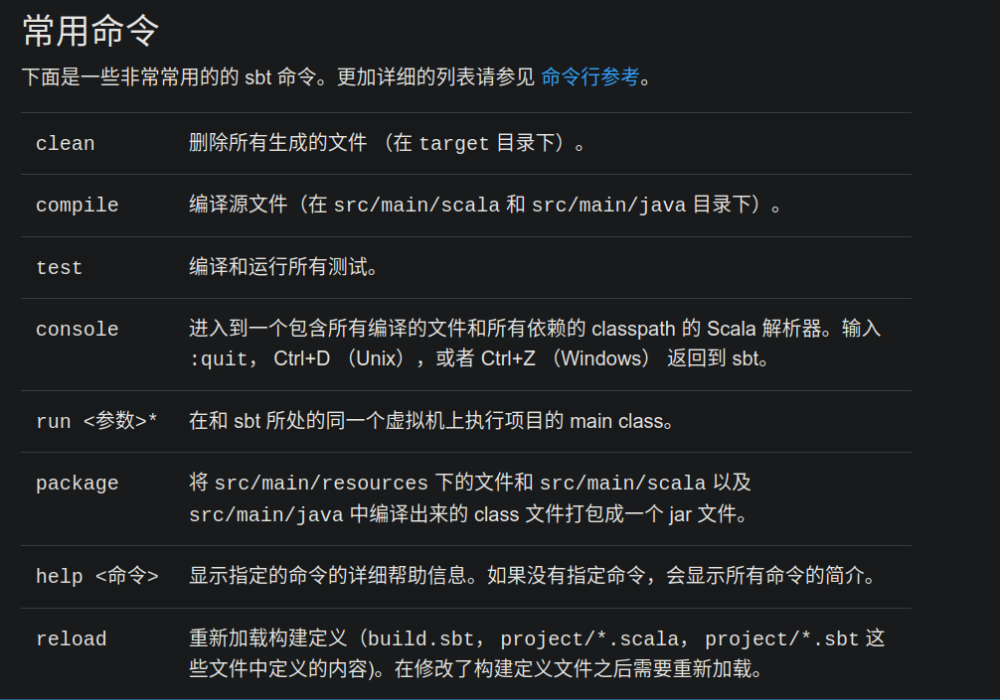

sbt部分：
====
在你的项目目录下运行 sbt 不跟任何参数：

$ sbt

执行 sbt 不跟任何命令行参数将会进入交互模式。交互模式有一个命令行（含有 tab 自动补全功能和历史记录）。

例如，在 sbt 命令行里输入 compile：

> compile

再次 compile，只需要按向上的方向键，然后回车。 输入 run 来启动程序。 输入 exit 或者 Ctrl+D （Unix）或者 Ctrl+Z （Windows）可以退出交互模式。

---

批处理模式 

你也可以用批处理模式来运行 sbt，可以以空格为分隔符指定参数。对于接受参数的 sbt 命令，将命令和参数用引号引起来一起传给 sbt。例如：

$ sbt clean compile "testOnly TestA TestB"

在这个例子中，testOnly 有两个参数 TestA 和 TestB。这个命令会按顺序执行（clean， compile， 然后 testOnly）。 

